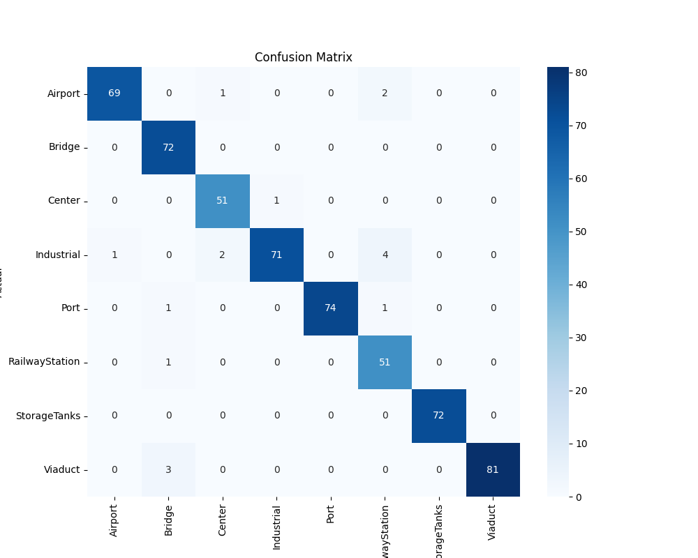

# 🛩️ Scene Classification using ML & Deep Learning

This repository created for the purpose of creating a model to classify aerial image scenes of critical infrastructure.  
Currently trained and validated on AID dataset using VGG-16, ResNet-50, ViT and a hybrid model ResNet-50 + ViT yielding results of around 99% accuracy.  
More information can be found in the attached [Report](https://github.com/lewisdoukas/scene-classification/blob/main/assets/AID_SceneClassification_Report.pdf) in Greek.

## ⛁ Data

- Aerial Image Dataset (AID): [Download](https://www.kaggle.com/datasets/jiayuanchengala/aid-scene-classification-datasets?resource=download)
- NWPU-RESISC45: [Download](https://onedrive.live.com/?redeem=aHR0cHM6Ly8xZHJ2Lm1zL3UvcyFBbWdLWXpBUkJsNWNhM0hOYUhJbHpwX0lYanM&cid=5C5E061130630A68&id=5C5E061130630A68%21107&parId=5C5E061130630A68%21112&o=OneUp)

## 🎯 Results

The following metrics concern Hybrid Model (ResNet-50 + ViT) trained and validated on AID (2232 and 558 images respectively).

| Metrics   |        |
| --------- | ------ |
| Accuracy  | 0.9982 |
| Precision | 0.9984 |
| Recall    | 0.9976 |
| F1-score  | 0.9980 |

### 🧮 Confusion matrix

## 🦾 Usage

Mainly used in Google Colab where torch, torchvision and the rest requirements are built-in.
